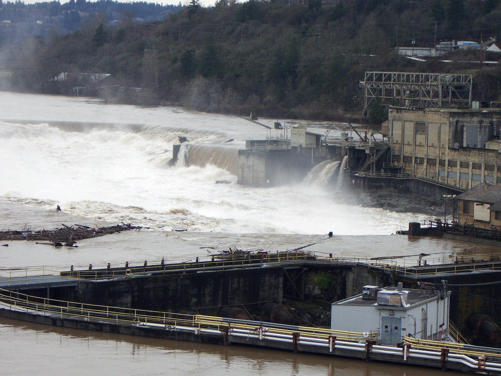

```{r setup, include=FALSE}
knitr::opts_chunk$set(
	echo = TRUE,
	message = FALSE,
	warning = FALSE
)
```


## Overview 

Testing... 

- **Summary** This report explores adult fish passage recorded from 2001-01-01 to 2010-12-31 at the Willamette Falls fish ladder on the Willamette River, Oregon.  This report is focused on Coho, Jack Coho, and Steelhead species.  First, a time series graph visualized time series data by month and year to explore trends over the 10-year time period.  Second, a season plot is created to explore seasonal trends for each species.  Lastly, a total counts figure illustrates the total number of observed fish passage for each species over the 10-year period.

### Image of Willamette Falls, OR
```{r, out.width='50%', fig.align='center', fig.cap='Photo of Willamette Falls, Oregon.  *Credit: EncMstr, CC BY-SA 3.0 <http://creativecommons.org/licenses/by-sa/3.0/>, via Wikimedia Commons'}
*
```


### Map of Willamette Falls
- A map of the fish ladder location (you can make this in R on your own, or include an existing map appropriately licensed, with attribution)
**Figure _.** Location of the fish ladder in Willamette Falls, Oregon.

**Citation:** Columbia Basin Research. (n.d.). Retrieved February 07, 2021, from http://www.cbr.washington.edu/dart/query/adult_graph_text *(I'm using APA format for now, but I'm not a big fan of this...Jen)*

## Adult Fish Passage at Willamette Falls {.tabset}

### Time series

```{r}

## Read in packages 
library(tidyverse)
library(here)
library(janitor)
library(lubridate)
library(tsibble)

## Read in the data, keep only the columns of interest, replace "NA" with 0, and clean names
fish_af <- read.csv(here("data", "willamette_fish_passage.csv")) %>% 
  select("Date", "Coho", "Jack.Coho", "Steelhead") %>% 
  mutate_all(~replace(., is.na(.), 0)) %>% 
  clean_names()
  
## Convert to tsibble 
fish_ts <- fish_af %>% 
  mutate(date = lubridate::mdy(date)) %>% 
  as_tsibble(key = NULL, index = date)

## Plot the time series data
# ggplot() +
#   geom_line(data = fish_ts, aes(x = date, y = coho)) +
#   labs(x = "Date",
#        y = "Number of Coho")

## Make data frames for each fish by monthyears  
coho_month <- fish_ts %>% 
  index_by(yr_mo = ~yearmonth(.)) %>% 
  summarize(monthly_mean_coho = mean(coho, na.rm = TRUE))

jack_month <- fish_ts %>% 
  index_by(yr_mo = ~yearmonth(.)) %>% 
  summarize(monthly_mean_jack = mean(jack_coho, na.rm = TRUE))

steel_month <- fish_ts %>% 
  index_by(yr_mo = ~yearmonth(.)) %>% 
  summarize(monthly_mean_steel = mean(steelhead, na.rm = TRUE))
```


```{r}
## Plot time series fish runs 
ggplot() +
  geom_line(data = coho_month,
       aes(x = yr_mo,
           y = monthly_mean_coho,
           colour = "Coho"),
        alpha = 0.7,
        size = 1.2) +
  geom_line(data = jack_month,
       aes(x = yr_mo,
           y = monthly_mean_jack,
           colour = "Jack Coho"),
       alpha = 0.7,
       size = 1.2) +
  geom_line(data = steel_month,
       aes(x = yr_mo,
           y = monthly_mean_steel,
           colour = "Steelhead"),
       alpha = 0.7,
      size = 1.2) +
  labs(x = "Month and Year",
       y = "Number of Fish",
       colour = "Species",
       title = "Adult Passage of Coho, Jack Coho, and Steelhead at Willamette Falls") +
  theme_minimal() +
  scale_colour_manual(values = c("dodgerblue4", "darkorchid4", "springgreen4")) 

  
```

- bullet points summarizing 
- trends... 

### Seasonplots
```{r}
# Attach feasts package
library(feasts)
```
 
```{r}
# Pivot longer
fish_ts_longer <- fish_ts %>%
  pivot_longer(2:4,
               names_to = "species", # Move each species to its own column
               values_to = "n") %>%
  group_by(species) %>% # Group by species
  index_by(yr_mo = ~yearmonth(.)) %>% # Group by year & month
  summarize(monthly_mean = mean(n, na.rm = TRUE)) # Summarize the mean for each species for each month
  

# Make seasonplot
fish_ts_longer %>%
  gg_season(y = monthly_mean)
```

- bulletpoint 1
- bulletpoint 2

### Summary Statistics and Analysis
```{r}
## Make data frames for each fish species by year
coho_year <- fish_ts %>% 
  index_by(yr = ~year(.)) %>% 
  summarize(year_count_coho = sum(coho, na.rm = TRUE))

jack_year <- fish_ts %>% 
  index_by(yr = ~year(.)) %>% 
  summarize(year_count_jack = sum(jack_coho, na.rm = TRUE))
steel_year <- fish_ts %>% 
  index_by(yr = ~year(.)) %>% 
  summarize(year_count_steel = sum(steelhead, na.rm = TRUE))


jack_year <- fish_ts %>% 
  index_by(yr = ~year(.)) %>% 
  summarize(year_count_jack = sum(jack_coho, na.rm = TRUE))

steel_year <- fish_ts %>% 
  index_by(yr = ~year(.)) %>% 
  summarize(year_count_steel = sum(steelhead, na.rm = TRUE))


## Plot annual totals for fish passage, for each of the 3 species
ggplot() +
  geom_line(data = coho_year,
       aes(x = yr,
           y = year_count_coho,
           colour = "Coho"),
        alpha = 0.7,
        size = 1.2) +
  geom_line(data = jack_year,
       aes(x = yr,
           y = year_count_jack,
           colour = "Jack Coho"),
       alpha = 0.7,
       size = 1.2) +
  geom_line(data = steel_year,
       aes(x = yr,
           y = year_count_steel,
           colour = "Steelhead"),
       alpha = 0.7,
      size = 1.2) +
  scale_x_continuous(breaks= c(2000,2001,2002,2003,2004,2005,2006,2007,2008,2009,2010)) +
  labs(x = "Year",
       y = "Number of Fish",
       colour = "Species",
       title = "Annual Adult Passage of Coho, Jack Coho, and Steelhead at Willamette Falls") +
  theme_minimal() +
  scale_colour_manual(values = c("dodgerblue4", "darkorchid4", "springgreen4")) 
```

```
## Summary
- bulletpoint 1
- bulletpoint 2
=======


**Figure 1.3** Annual toal Coho, Jack Coho, and Steelhead passage observation were recorded at the Willamette Falls fish ladder on the Willamette River (Oregon) from 2001-2010. Data were shared by and accessed from Columbia River DART (Data Access in Real Time).

**Summary**

- From 2001 to 2010, Steelhead observations showed a steady decline, with a small rebound between 2009-2010.

- Coho observations increased drastically, from ~5,000/year to ~25,000/year in 2009.

- Jack Coho observations remained relatively consistent over the 10-year period.

